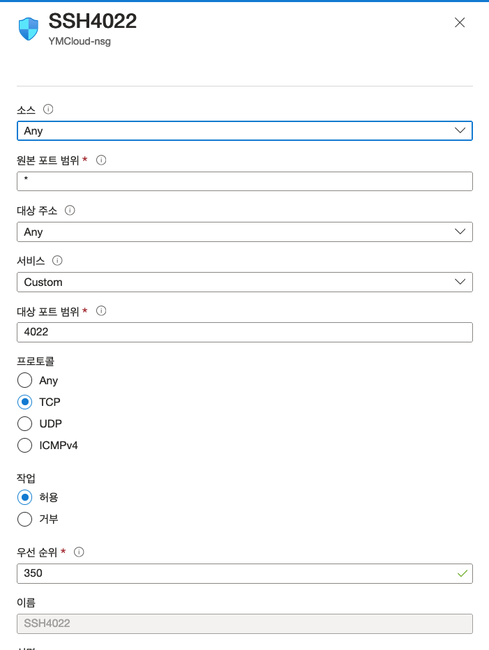
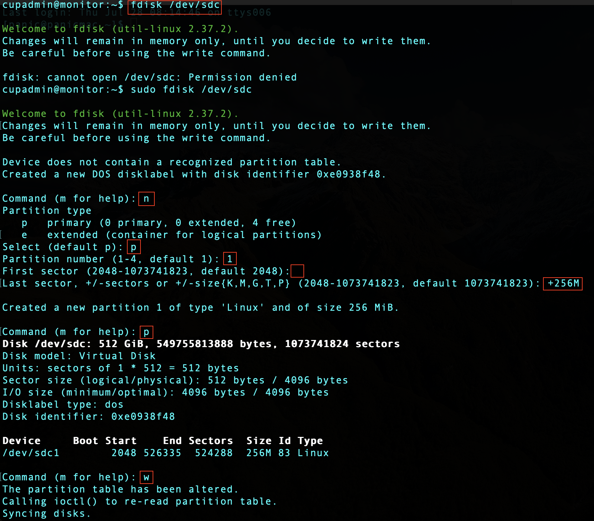
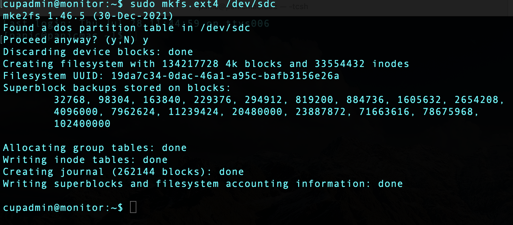
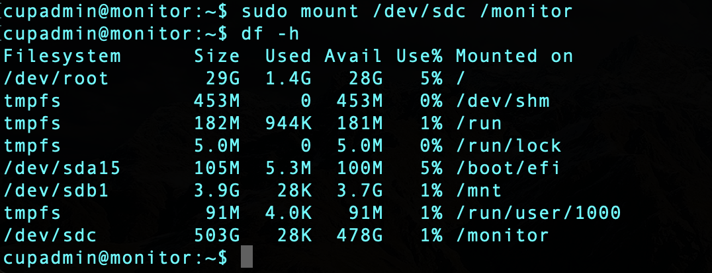
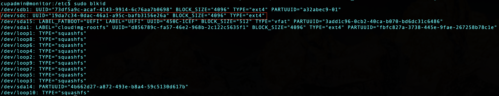
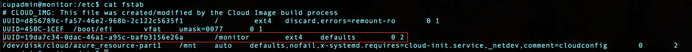

# Virtual Machine

### Contents
1. [VM Setting](#vm-setting)
2. [VM ssh Setting](#vm-ssh-setting)
3. [VM mount Setting](#vm-mount-setting)

## VM Setting
### First login
* Change password

	</img>
* Sudo permission
	* `sudo nano /etc/sudoers`
		* `cupadmin ALL=NOPASSWD: ALL`
	
* `sudo apt update && sudo apt upgrade`
* Install emacs
	* `sudo apt install emacs`

* Timezone
	* `sudo ln -sf /usr/share/zoneinfo/Asia/Seoul /etc/localtime`

## VM ssh Setting
* Change ssh port from `22` to `4022`
	* Add ssh port `4022`
	* After VM setting, remove port `22`

</img>

* Connect to VM
	* `sudo emacs /lib/systemd/system/ssh.socket`
		* `ListenStream=4022`
	* `sudo emacs /etc/ssh/sshd_config`
		* `Port 4022`
	* `sudo systemctl daemon-reload`
	* `sudo systemctl restart ssh`
	* `sudo systemctl status ssh`

## VM mount Setting
* Mount additional disk
	* `lsblk -o NAME,HCTL,SIZE,MOUNTPOINT |grep -i "sd"`

	</img>

* Write new partition
	* `sudo fdisk /dev/sdc`
	* `n` &rarr; `p` &rarr; `1` &rarr; `Enter` &rarr; `+256M` &rarr; `p`
	* Save with `w`

	</img>

* Format with ext4
	* `sudo mkfs.ext4 /dev/sdc`
	
	</img>
	
* Mount
	* `sudo mkdir /data`
	* `sudo mount /dev/sdc /data`
	* `sudo chown cupadmin:cupadmin /data`
	
	</img>
	
* Auto mount (After reboot)
	* Find `uuid`
		* `sudo blkid` 
		
	</img>

	* Edit `/etc/fstab`
	
	</img>
	